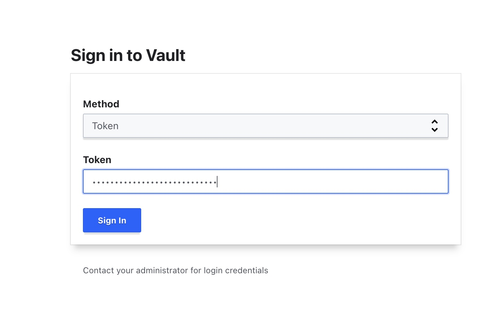
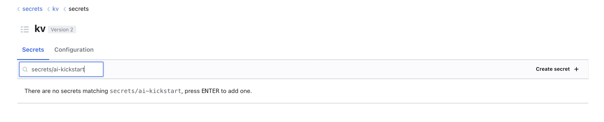
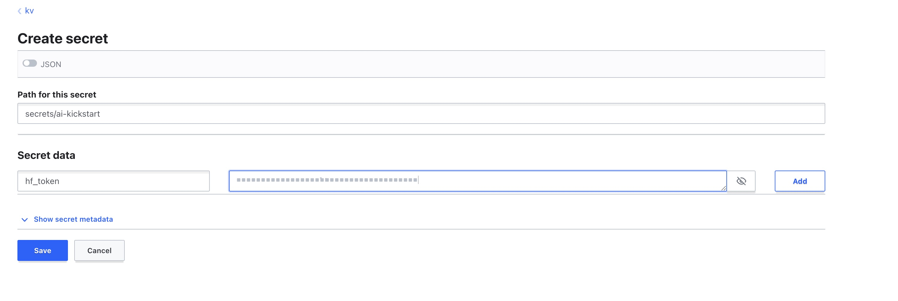
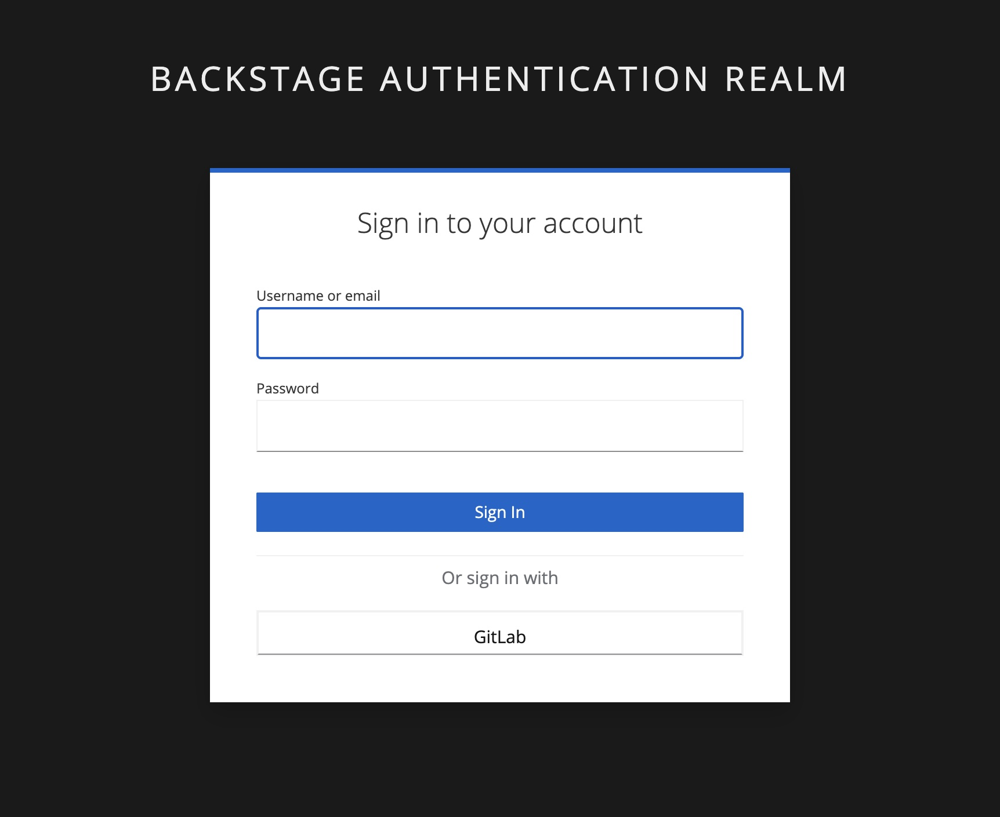
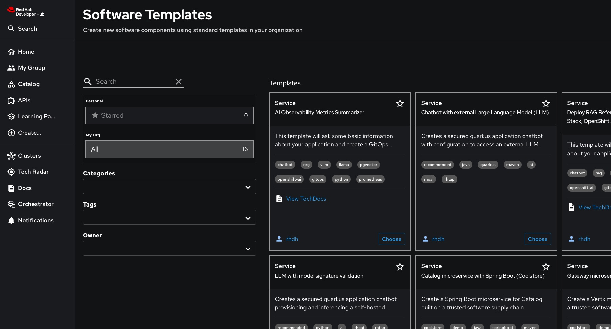
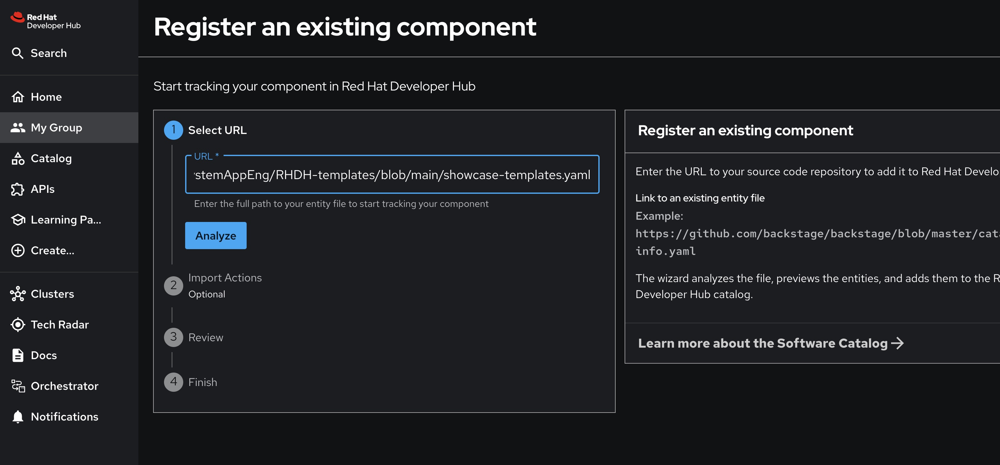
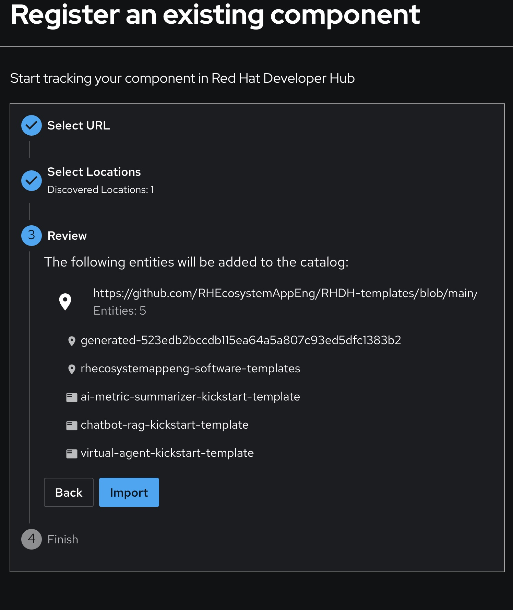

This guide provides step-by-step instructions for installing the Red Hat Golden Template path using the RHEcosystemAppEng/RHDH-templates repository.


---

## ✅ Prerequisites

Before getting started, ensure you have the following:

- **OpenShift CLI (oc)**: [Download and install](https://developers.redhat.com/learning/learn:openshift:download-and-install-red-hat-openshift-cli/resource/resources:download-and-install-oc) Openshift command-line interface
- **Platform Access**: Access to either [TAP](https://docs.redhat.com/en/documentation/red_hat_trusted_application_pipeline/1.0/html-single/installing_red_hat_trusted_application_pipeline/index) or a running RHDH instance. Helm Chart installation available [here](https://github.com/redhat-ai-dev/ai-rhdh-installer)
-  **Hugging Face API Token**: A valid authentication token from [Hugging Face](https://huggingface.co/docs/hub/en/security-tokens)
---
### 🚀 Step-by-Step Instructions

### 1. Create a Kubernetes secret for HF token


## 🔓 Without Vault
Set up your Hugging Face authentication:
1. Configure your token as an environment variable:
   ```bash
   export HF_TOKEN=<your huggingface token>
   ```
   Replace <your-huggingface-token> with your actual Hugging Face API token.

2. Create the secret in your OpenShift namespace:
   ```bash
   oc create secret generic huggingface-secret \
     -n <your-namespace> \
     --from-literal=HF_TOKEN=$HF_TOKEN
   ```
   Replace <your-namespace> with the namespace where your RAG application is deployed.


---

### 🔐 With Vault + External Secrets Operator
> **Note**: Use this approach if you have Vault and External Secrets Operator configured in your cluster for centralized secret management.

1. **Access Vault UI**:
   ```bash
   # Get the Vault route
   oc get route -n vault
   
   # Get the Vault token
   oc get secret -n vault vault-token -o jsonpath="{.data.token}" | base64 --decode
   ```
   Open the Vault route in your browser and log in using the token method with the retrieved token.
   
   

2. **Create the secret in Vault**:
   - Select the **KV** secret engine
   - Navigate to: `secret/`
   - Set path as: `secrets/ai-kickstart`
   - Click **Create secret** (Shown on image 1)
   - Add secret data:
     - **Key**: `hf_token`
     - **Value**: `<your-huggingface-token>`
   - Click **Save** (Shown on image 2)
  
      (1)

      
      
      (2)

        
      
  > **Note**: **The ExternalSecret Operator will map `hf_token` → Kubernetes key `HF_TOKEN`**

---

### 2. Login to the Developer Hub



---

### 3. Register AI Templates

1. **Navigate to Create**:
   - From the Developer Hub sidebar, click **"Create"**
 
      
2. **Register templates**:
   - Click **"Register Existing Component"**

3. **Import the template repository**:
   - Paste this URL into the input field:
     ```
     https://github.com/RHEcosystemAppEng/RHDH-templates/blob/main/showcase-templates.yaml
     ```
   - Click **"Analyze"**

      

   - Click **"Import"** to complete registration
 
      
---
### 4. Available Templates

Once registered, you'll see these AI-powered templates in the Catalog->Template page:

- **🤖 RAG Chatbot Kickstart** (`chatbot-rag-kickstart-template`)  
  Deploy a complete RAG (Retrieval Augmented Generation) architecture using LLaMA Stack, OpenShift AI, and PGVector. Includes document ingestion pipeline and vector database for intelligent question-answering.

- **🎯 AI Virtual Agent** (`ai-virtual-agent-kickstart-template`)  
  Create an intelligent virtual assistant powered by OpenShift AI and PGVector. Perfect for building conversational AI applications with advanced reasoning capabilities.

- **📊 AI Metrics Summarizer** (`ai-metric-summarizer-kickstart-template`)  
  Build a specialized chatbot that analyzes AI model performance metrics from Prometheus and generates human-readable summaries using LLaMA models. Ideal for AI observability and monitoring.

---
### 5. Launch a Template

Once you've registered the templates, follow these steps to deploy an AI application:

#### **Navigate to Self-Service Catalog**
- From the Developer Hub sidebar, click **"Create"**
- You'll see the available AI templates listed

#### **Choose Your Template**
Select one of the registered templates:
- **Chatbot-Rag Kickstart** - for RAG document-based Q&A systems
- **AI Virtual Agent** - for conversational AI assistants  
- **AI Metrics Summarizer** - for AI observability and monitoring

#### **Configure Template Parameters**
Fill in the guided form with your specifications:

**Application Information:**
- **Name**: Unique identifier for your component (e.g., `my-ai-chatbot`)
- **Owner**: Select from available users/groups
- **Description**: Brief description of your application

**Repository Details:**
- **Host Type**: Choose GitHub or GitLab
- **Repository Owner**: Your organization or username
- **Repository Name**: Name for the source repository
- **Namespace**: Kubernetes namespace for deployment

**AI Model Configuration:**
- **Language Model**: Select from available LLaMA variants
- **Safety Model**: Optional LLaMA Guard for content filtering
- **GPU Tolerance**: Configure hardware requirements

#### **Review and Create**
- Review all configured parameters
- Click **"Review"** to validate your inputs
- Click **"Create"** to initiate the template deployment

#### **Automatic Deployment Process**
The template will automatically:
1. **Build** the software component with your specifications
2. **Publish** source and GitOps repositories to your chosen platform
3. **Register** the component in the Developer Hub catalog
4. **Deploy** via ArgoCD using GitOps workflows

#### **Access Your Application**
Once complete, use the provided links to:
- View source repository
- Monitor GitOps deployment  
- Access the component in the catalog
- Review ArgoCD applications